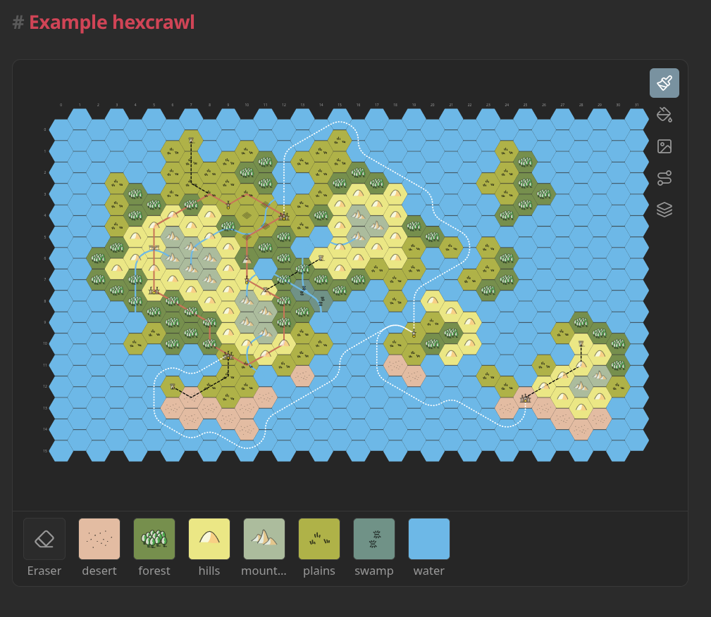

# Obsidian Hexcrawl

Turn a folder of notes into a fully interactive, easily editable hex map. Drop a `hexcrawl` code block into any note, point it at a folder, and every note with `hex-q`/`hex-r` frontmatter becomes a hex on the map. The map itself isn't a static picture: paint terrain, drop icons, and draw paths straight onto it with the built-in toolbar.



## Features

- **Notes as hexes** — coordinates live in frontmatter; click a hex to open its note.
- **Built-in editing toolbar** — fill terrain, place icons, and draw paths directly on the map, with per-layer visibility toggles; every action is saved straight back to the note's frontmatter.
- **Pan & zoom** — scroll to zoom on the cursor, drag to pan, auto-fit on load.
- **Terrain palettes** — named and reusable from Settings → Hexcrawl, or defined inline per block.
- **Icons** — point a palette at your own icon folder; override per hex when needed.
- **Paths** — roads, rivers, borders — straight or smooth splines drawn across hexes.

## Quick start

````markdown
```hexcrawl
folder: Hexes
orientation: pointy
cols: 10
rows: 8
```
````

And a hex note anywhere in that folder:

```yaml
---
hex-q: 3 # column (0-based)
hex-r: 2 # row (0-based)
hex-terrain: forest
---
```

## Installation

Not yet on the community plugin store. To install manually:

1. Build the plugin (see [Development](#development)).
2. Copy `main.js`, `manifest.json`, and `styles.css` to `<vault>/.obsidian/plugins/obsidian-hexcrawl/` (or just make a soft link).
3. Enable **Hexcrawl** under Settings → Community plugins.

## Alternatives & Inspiration

- Alex Schroeder's [Text Mapper](https://src.alexschroeder.ch/text-mapper.git/) and its [port for Obsidian](https://github.com/modality/obsidian-text-mapper).
- [Hexmap World Creator](https://github.com/sbuffkin/hexmaker) for Obsidian (`obsidian-hexcrawl` aims to achieve the same results with a bit more straightforward and flexible approach).
- [The Great Antarctic Hexcrawl pt. 9](https://idraluna-archives.bearblog.dev/the-great-antarctic-hexcrawl-pt-9-cartography-naming-stuff-diversifying-regions-markdown/).
- [Hexagonal Grids](https://www.redblobgames.com/) by Amit Patel.

This plugin uses the Gnomeyland icons pack by Gregory B. MacKenzie for the default terrain palette (see [Palettes](#palettes)). The Gnomeyland icons are licensed under the [Creative Commons Attribution-ShareAlike 4.0 International License](https://creativecommons.org/licenses/by-sa/4.0/).

## Reference

### Editing on the map

A toolbar pinned to the top-right corner of every rendered map lets you edit it directly, with no frontmatter to hand-write:

| Tool   | What it does                                                                                                    |
| ------ | --------------------------------------------------------------------------------------------------------------- |
| Brush  | Paint a terrain onto hexes one click at a time; pick "Eraser" to clear it.                                      |
| Bucket | Flood-fill connected same-terrain hexes with a new one.                                                         |
| Icon   | Drop an icon from the palette's icon folder onto a hex, or erase it.                                            |
| Path   | Draw a new road/river by clicking hexes in order, or click an existing path to move, add, or remove its points. |
| Layers | Toggle terrain, icons, and paths on or off independently.                                                       |

Every change is written straight to the affected note's frontmatter (or creates a new path note), so the map and the notes never drift apart.

### Code block options

| Key           | Required | Default                | Description                                                                                                            |
| ------------- | -------- | ---------------------- | ---------------------------------------------------------------------------------------------------------------------- |
| `folder`      | yes      | —                      | Vault-relative path to the folder containing hex notes (scanned non-recursively).                                      |
| `cols`        | yes      | —                      | Number of columns to render.                                                                                           |
| `rows`        | yes      | —                      | Number of rows to render.                                                                                              |
| `orientation` | no       | `pointy`               | `pointy` or `flat`. Pointy-top hexes stagger by row; flat-top hexes stagger by column.                                 |
| `stagger`     | no       | `odd`                  | Which row (pointy) or column (flat) is the shifted one.                                                                |
| `hexSize`     | no       | `40`                   | Hex radius (center to vertex) in pixels.                                                                               |
| `height`      | no       | `500`                  | Height of the visible map panel, in pixels. Width fills the note.                                                      |
| `coords`      | no       | `false`                | Show q/r coordinate labels along the top and left axes.                                                                |
| `palette`     | no       | default global palette | Name of a global palette (e.g. `palette: Wikipedia`), or an inline mapping for a one-off palette scoped to this block. |
| `paths`       | no       | —                      | Vault-relative path to a folder of path notes (roads, rivers, ...).                                                    |

### Palettes

Manage named palettes vault-wide from Settings → Hexcrawl. Add, duplicate, delete, mark a default, and edit each one's terrain/path entries and icons folder (with a picker and live preview). Leave a palette's icons folder empty to use the plugin's bundled icon pack; set one to use only icons from that vault folder instead — the two are never combined.

A `hexcrawl` block picks one with `palette: <name>`, or omits it to use the default.

The same shape also works inline, scoped to a single block:

```yaml
palette:
  icons: TTRPG/Icons
  terrain:
    forest:
      color: "#3F7A52"
      icon: forest
    hills:
      color: "#D68F4E"
  paths:
    road:
      color: "#A9895F"
      dash: dashed
    river:
      color: "#4A90C2"
      width: 4
      spline: true
```

| Terrain key | Required | Description                                                                                                          |
| ----------- | -------- | -------------------------------------------------------------------------------------------------------------------- |
| `color`     | no       | Hex fill color.                                                                                                      |
| `icon`      | no       | Filename basename (no extension) looked up in the palette's `icons` folder, or the bundled icon pack if none is set. |

| Path key | Required | Default             | Description                                                     |
| -------- | -------- | ------------------- | --------------------------------------------------------------- |
| `color`  | no       | `var(--text-muted)` | Stroke color.                                                   |
| `width`  | no       | `3`                 | Stroke width in pixels.                                         |
| `dash`   | no       | `solid`             | `solid`, `dashed`, or `dotted`.                                 |
| `spline` | no       | `false`             | Smooth curve vs. straight segments, unless a note overrides it. |

`hex-icon` on a note always wins over the palette's icon. A `hex-terrain` or `path-type` with no palette match falls back to being used directly as a CSS color.

### Hex note frontmatter

| Frontmatter key | Required | Description                                                                                                                                                    |
| --------------- | -------- | -------------------------------------------------------------------------------------------------------------------------------------------------------------- |
| `hex-q`         | yes      | Column coordinate (integer).                                                                                                                                   |
| `hex-r`         | yes      | Row coordinate (integer).                                                                                                                                      |
| `hex-terrain`   | no       | Looked up against the palette's terrain names; falls back to a literal CSS color (e.g. `#4a7c3f`, `green`) if no match. Omit for an uncolored hex.             |
| `hex-icon`      | no       | Icon basename (no extension) from the active palette's icons folder (or its bundled pack, if none is set). Overrides the palette's own icon for `hex-terrain`. |

A note missing or non-integer `hex-q`/`hex-r` is ignored.

### Paths (roads, rivers, etc)

Each path is its own note in the block's `paths` folder. The note's title doubles as its name unless `path-name` is set:

```yaml
---
path-type: road
path-hexes:
  - [2, 3]
  - [3, 3]
  - [3, 4]
path-spline: true
---
```

| Frontmatter key | Required | Description                                                                                                          |
| --------------- | -------- | -------------------------------------------------------------------------------------------------------------------- |
| `path-hexes`    | yes      | Ordered list of `[q, r]` pairs (at least 2). The path is drawn through each hex's center, in order.                  |
| `path-type`     | no       | Looked up against the palette's path types; also applied as a CSS class (`hexcrawl-path-{type}`) for custom styling. |
| `path-spline`   | no       | Overrides the type's default curve/straight rendering for this path.                                                 |

## Development

```bash
npm install
npm run dev            # watch build
npm run build          # production build (type-checks first)
npm test               # run unit tests
npm run lint           # eslint
npm run format:check   # prettier --check
```

Install the [pre-commit](https://pre-commit.com/) hook once per clone so typecheck/lint/format issues are caught before you push (same checks CI runs):

```bash
pre-commit install
```
